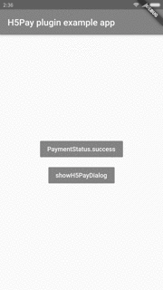

# h5pay

[](https://pub.dev/packages/h5pay)

An H5 payment (such as Alipay, WeChat Pay) plugin for flutter.

</img>

## Usage

You can use the `showH5PayDialog` method to show a loading dialog and jump to payment app. When user switches from payment app to your app, the dialog will auto check the payment result.

```dart
import 'package:h5pay/h5pay.dart';

final PaymentStatus status = await showH5PayDialog(
  context: context,
  paymentSchemes: const ['alipay', 'alipays', 'weixin', 'wechat'], 
  getSchemeUrlTimeout: const Duration(seconds: 5),
  jumpTimeout: const Duration(seconds: 3),
  getH5Url: () async => 'xxx', // get payment url (http or app scheme url)
  verifyResult: () async => true // check order result from your server,
);
if (status == PaymentStatus.success) {
  // Do something
}
```

Values of `PaymentStatus`:

```dart
enum PaymentStatus {
  idle,
  gettingSchemeUrl,
  getSchemeUrlTimeout,
  jumping,
  cantJump, // Maybe target payment app is not installed
  jumpTimeout,
  verifying,
  success,
  fail,
}
```

### Advanced

If you have more complex requirements, you can use the `H5PayWidget`. Check the [example](example) for more detail.
